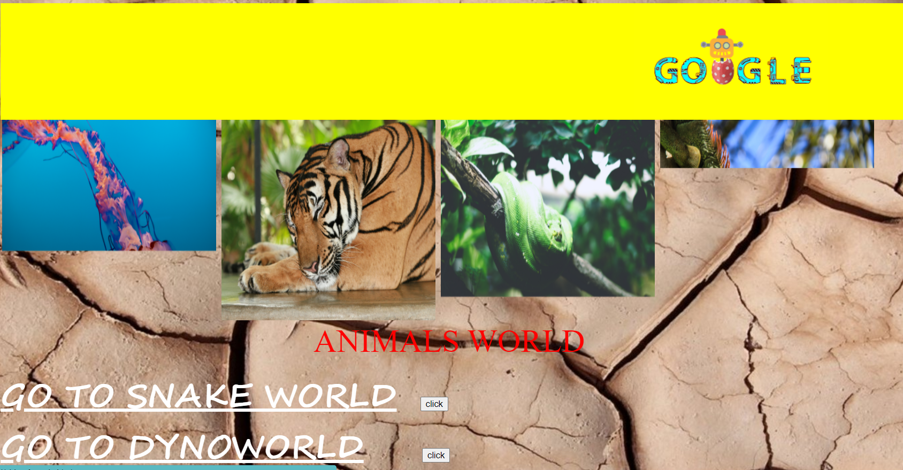
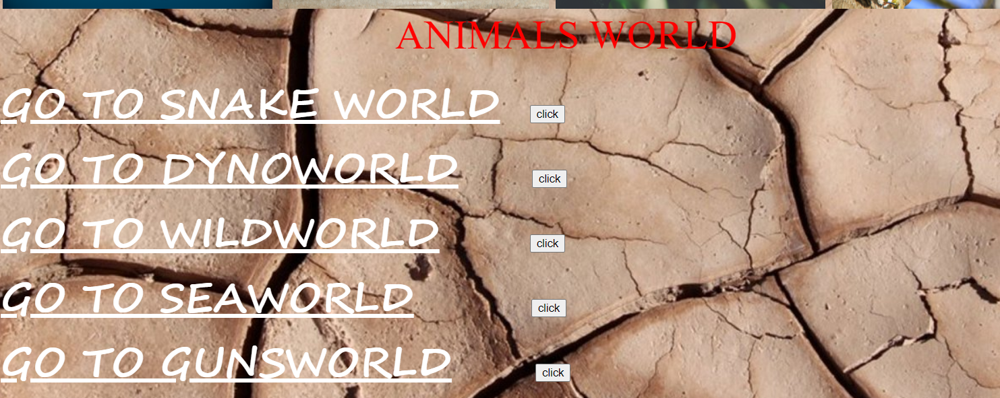
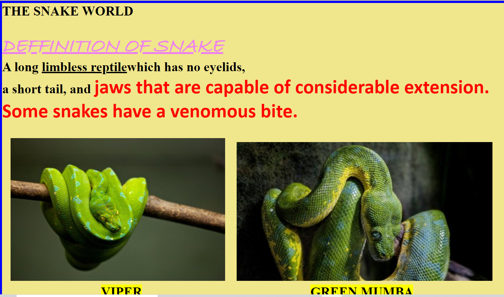
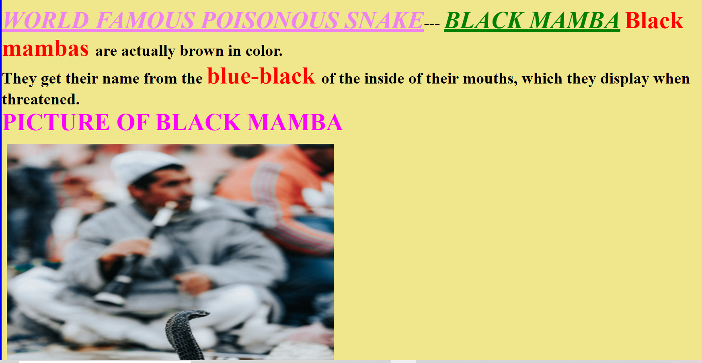
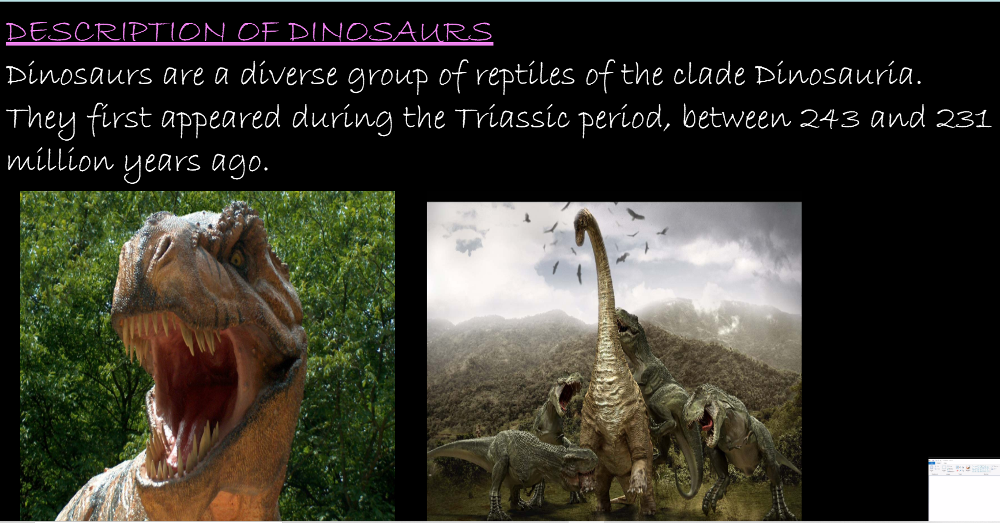
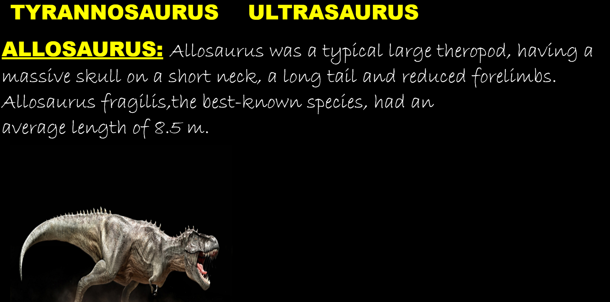
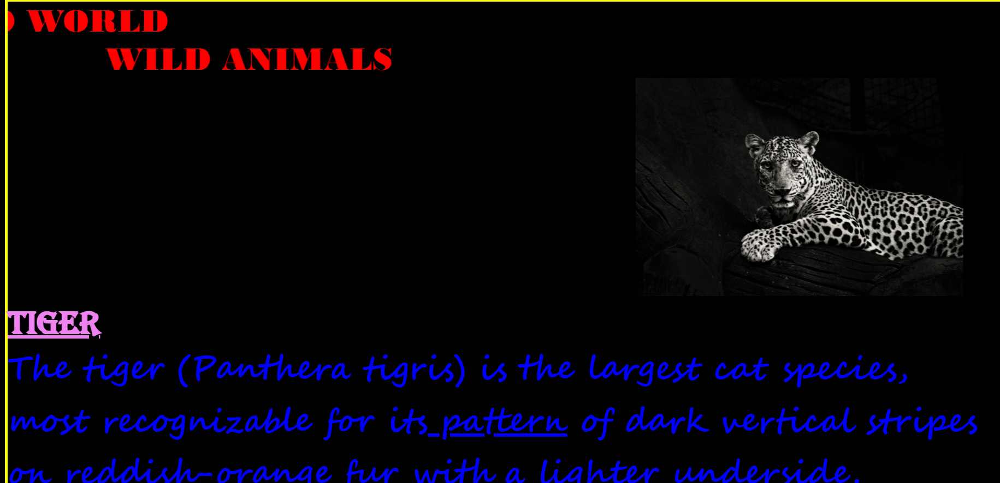
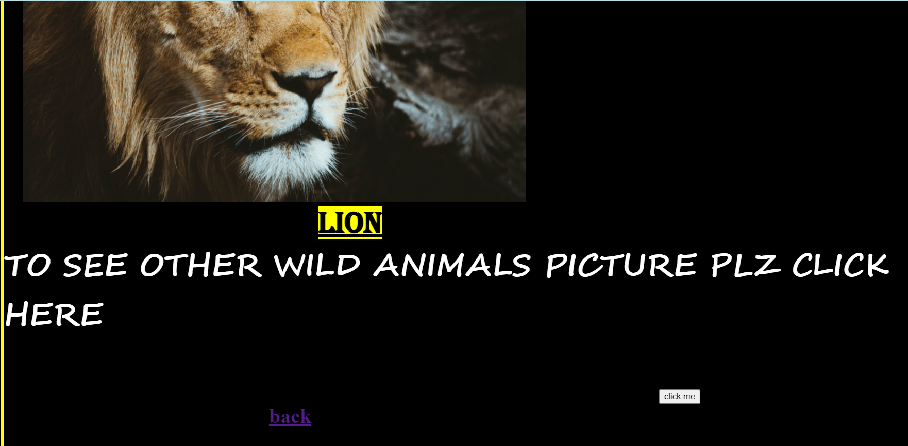
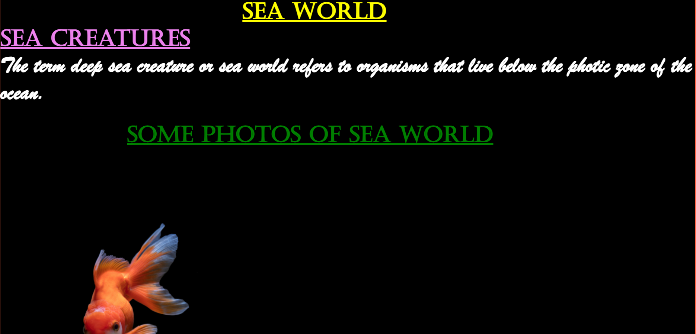

# ANIMAL_WORLD-BASIC_WEBSITE :star_struck: :family: :man: :woman: :sunny:

[](https://shields.io/) 

***This new WebSite named 'ANKIMAL-WORLD-FESTIVALS' is created by Biswarup Bhattacharjee, student of BTECH, in University of Engineering and Management, Kolkata.***

**Email Id: bbiswa471@gmail.com.** 

**Contact No: 916290272740.** 

<p align="left">
<a href="https://www.facebook.com/profile.php?id=100070395300810" target="blank"></a>
<a href="https://instagram.com/biswarup2210" target="blank"></a>
<a href="https://github.com/biswa2210/biswa2210" target="blank"></a>
</p>

## About :point_down: 

This is a simple static website which contains different web pages on snakes, dynasours, wild animals, sea world and guns and weapons. This is an interesting and simple website which is made uing html. I have collected some resources on animals and designed the web pages using html.

## LINK of full project: :point_right: https://biswa2210.github.io/ANIMAL_WORLD-BASIC_WEBSITE/main.html. 

## Purpose :point_down:

<div align="justified">
     
I have made thisnwebsite to practice designing wesbite using html.
     
</div>

## Importance :point_down:

<div align="justified">
 
From this website user can knnow about dynasours, snakes, tigers, lions and guns.

</div>

## Folder Structure :point_down:

```bash
ANKIMAL-WORLD-BASIC-WEBSITE
     ├── AK.html
     ├── LA.html
     ├── MCM.html
     ├── MC.html
     ├── RG.html
     ├── SR.html
     ├── TYS.html
     ├── ULS.html
     ├── index.html
     ├── dyasourous.html
     ├── gun.html
     ├── main.html
     ├── sea.html
     ├── sf.html
     ├── snake.html
     ├── ss.html
     ├── st.html
     ├── wild.html
     └── wp.html
 ```               
## Making :point_down:

I have made this website using html5 wth resources of animals.

## Screenshots :point_down: 

<div align="center">
     
<a href="pics/an1.PNG"></a> <a href="pics/an2.PNG"></a>
    
<a href="pics/an3.PNG"></a> <a href="pics/an4.PNG"></a>
     
<a href="pics/an5.PNG"></a> <a href="pics/an6.PNG></a>
     
<a href="pics/an7.PNG"></a> <a href="pics/an8.PNG"></a>
     
<a href="pics/an9.PNG"></a> <a href="pics/an10.PNG"></a>

</div>


